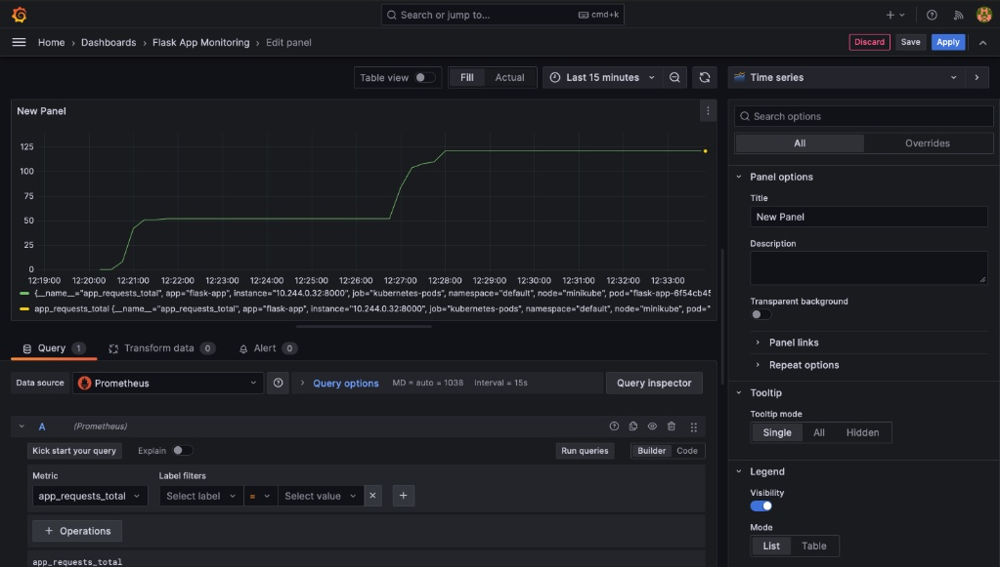

# ☸️ K8s Observability Stack

**A full-cycle, GitOps-based monitoring solution for Kubernetes.**

This project demonstrates an **End-to-End DevOps workflow**: from Python application development to infrastructure orchestration and advanced observability using **Prometheus** and **Grafana** — all deployed and managed declaratively through **ArgoCD**.


## 🚦 Quick Start 

1. **Clone this repo** → `git clone https://github.com/omerbeithalahmy/k8s-observability-stack.git`
2. **Start Minikube** → `minikube start --cpus 4 --memory 8192 --driver=docker`
3. **Install ArgoCD** → Follow [Step 2](#step-2-install-argocd)
4. **Deploy everything** → `kubectl apply -f argocd/`
5. **Open Grafana** → Follow [Accessing Grafana](#-accessing-grafana)


## 📸 Screenshots

### Cluster-Level Monitoring — Node Exporter Dashboard


### Application-Level Monitoring — Custom Metrics Dashboard


---

## 🚀 Tech Stack

| Layer               | Technology                                       |
|---------------------|--------------------------------------------------|
| **Infrastructure**  | Kubernetes (Minikube), Docker                    |
| **GitOps & CD**     | ArgoCD                                           |
| **Monitoring**      | Prometheus `v25.11.0`, Grafana `v7.3.0`          |
| **IaC**             | Helm Charts (custom-built)                       |
| **Application**     | Python (Flask) with Custom Prometheus Metrics    |
| **Stress Testing**  | Kubernetes Jobs (self-cleaning)                  |

---

## 🏗️ Architecture Overview

```
┌─────────────────────────────────────────────────────────────────┐
│                        Git Repository                           │
│  argocd/application.yaml    argocd/monitoring.yaml              │
└──────────────┬──────────────────────────┬───────────────────────┘
               │                          │
               ▼                          ▼
┌──────────────────────┐    ┌──────────────────────────────────┐
│       ArgoCD         │    │           ArgoCD                  │
│  Watches & Syncs     │    │       Watches & Syncs             │
└──────────┬───────────┘    └──────────────┬───────────────────┘
           │                               │
           ▼                               ▼
┌──────────────────────┐    ┌──────────────────────────────────┐
│  Flask App (Helm)    │    │     Monitoring Namespace          │
│  ┌────────────────┐  │    │  ┌────────────┐ ┌─────────────┐  │
│  │ Pod:5000 (HTTP) │  │    │  │ Prometheus │ │   Grafana   │  │
│  │ Pod:8000 (Metrics)│ │    │  │  (scrapes) │ │ (dashboards)│  │
│  └────────────────┘  │    │  └──────┬─────┘ └──────┬──────┘  │
│  Annotations:        │    │         │              │          │
│  prometheus.io/scrape│◄───│─────────┘              │          │
│  prometheus.io/port  │    │                        │          │
└──────────────────────┘    │  ┌──────────────┐      │          │
                            │  │ Node Exporter│──────┘          │
                            │  │ (host metrics)│                │
                            │  └──────────────┘                 │
                            └──────────────────────────────────┘
```

**Flow:**
1. **ArgoCD** watches this Git repo and auto-syncs any changes to the cluster.
2. The **Flask App** is deployed via a custom Helm chart and exposes custom Prometheus metrics on port `8000`.
3. **Prometheus** scrapes metrics from the Flask app (via pod annotations) and from **Node Exporter** (host-level metrics).
4. **Grafana** visualizes everything through pre-configured dashboards.

---

## 🌟 Key Features

### 1. 🔄 Zero-Touch GitOps Workflow
The entire cluster state is managed via Git — no imperative commands needed.
- ArgoCD monitors the repository and **auto-syncs** changes with `selfHeal: true` and `prune: true`.
- Both the custom Flask app and the full monitoring stack are managed as ArgoCD Applications.

### 2. 📊 Full Cluster Observability
Real-time dashboards for **CPU**, **Memory**, **Network**, and **Disk** usage at the node level.
- Metrics collected via **Node Exporter**.
- Dashboard JSON backups stored in `observability/` as code.

### 3. 📈 Application-Level Custom Metrics
Unlike standard monitoring, this project **instruments the Python code** to expose business-logic metrics.
- **Custom Metric:** `app_requests_total` — counts every user request to the web server.
- **Implementation:** `prometheus-client` Python library + Kubernetes pod annotations for automatic scraping.
- The app exposes metrics on port `8000` at the `/metrics` endpoint.

### 4. 💥 Automated Stress Testing
A declarative Kubernetes Job simulates high CPU and memory load to verify monitoring and alerting.
- **3 parallel containers** each spawning **multiple CPU-burning processes**.
- Total capacity: **5 CPU cores + 1.5GB RAM** for 60 seconds.
- Automatically terminates after **60 seconds** and cleans itself up after **30 seconds**.
- Watch the CPU and memory graphs **spike dramatically** and then drop back to normal on Grafana!

### 5. 🐳 Production-Ready Helm Chart
The Flask app is packaged as a custom Helm chart with:
- Configurable replicas, image, and resource limits.
- **Liveness** and **Readiness** probes on `/health`.
- Prometheus scraping annotations baked into the pod template.

---

## 🛠️ Project Structure

```
k8s-observability-stack/
│
├── app/                              # Python Application Source
│   ├── main.py                       # Flask app with Prometheus instrumentation
│   ├── Dockerfile                    # Container image build
│   └── requirements.txt             # Python dependencies (flask, prometheus-client)
│
├── argocd/                           # ArgoCD Application Manifests (GitOps Brain)
│   ├── application.yaml              # Deploys the Flask app via Helm chart
│   └── monitoring.yaml               # Deploys Prometheus + Grafana from Helm repos
│
├── charts/                           # Custom Helm Charts
│   └── flask-app/
│       ├── Chart.yaml                # Chart metadata (v0.1.0)
│       ├── values.yaml               # Default values (image, resources, service)
│       └── templates/
│           ├── deployment.yaml       # Deployment with Prometheus annotations
│           └── service.yaml          # ClusterIP service
│
├── observability/                    # Monitoring Configuration as Code
│   ├── stress-test.yaml              # CPU load-generator Job
│   ├── node-exporter-dashboard.json  # Grafana dashboard backup (cluster metrics)
│   └── app-dashboard.json            # Grafana dashboard backup (app metrics)
│
├── screenshots/                      # Project screenshots for documentation
│
├── .gitignore
└── README.md
```

---

## 💻 Getting Started

### Prerequisites

Make sure the following tools are installed on your machine:

| Tool       | Purpose                          | Install Guide                                              |
|------------|----------------------------------|------------------------------------------------------------|
| **Docker** | Container runtime                | [docs.docker.com](https://docs.docker.com/get-docker/)     |
| **Minikube** | Local Kubernetes cluster       | [minikube.sigs.k8s.io](https://minikube.sigs.k8s.io/docs/start/) |
| **kubectl** | Kubernetes CLI                  | [kubernetes.io](https://kubernetes.io/docs/tasks/tools/)   |
| **Helm**   | Kubernetes package manager       | [helm.sh](https://helm.sh/docs/intro/install/)             |

---

### Step 1: Start the Kubernetes Cluster

Launch Minikube with enough resources for the monitoring stack:

```bash
minikube start --cpus 4 --memory 8192 --driver=docker
```

---

### Step 2: Install ArgoCD

Deploy the GitOps controller into the cluster:

```bash
# Create the ArgoCD namespace
kubectl create namespace argocd

# Install ArgoCD
kubectl apply -n argocd -f https://raw.githubusercontent.com/argoproj/argo-cd/stable/manifests/install.yaml
```

Wait for all ArgoCD pods to become ready:

```bash
kubectl wait --for=condition=available --timeout=300s deployment --all -n argocd
```

**(Optional)** Access the ArgoCD UI:

```bash
# Get the initial admin password
kubectl -n argocd get secret argocd-initial-admin-secret -o jsonpath="{.data.password}" | base64 -d; echo

# Port-forward to access the UI
kubectl port-forward svc/argocd-server -n argocd 8080:443
```

Access at: **https://localhost:8080** (user: `admin`)

---

### Step 3: Deploy the Stack 🪄

This is where the magic happens. Apply the ArgoCD Application manifests that point to this Git repository:

```bash
# Deploy the Flask App (via the custom Helm chart)
kubectl apply -f argocd/application.yaml

# Deploy the Monitoring Stack (Prometheus + Grafana)
kubectl apply -f argocd/monitoring.yaml
```

ArgoCD will now automatically:
1. Clone this repository.
2. Render the Helm chart / apply the manifests.
3. Deploy everything to the cluster.
4. Continuously sync any future Git changes.

Wait for all pods to become **Healthy** and **Synced** in the ArgoCD UI.

---

### Step 4: Verify All Pods Are Running

```bash
# Check the Flask app
kubectl get pods -n default

# Check the monitoring stack
kubectl get pods -n monitoring
```

You should see pods for `flask-app`, `prometheus-server`, and `grafana` all in `Running` state.

---

### Step 5: Build & Push the Docker Image (Only if Modifying the App)

The Helm chart pulls a pre-built image from Docker Hub. If you make changes to the Python code in `app/`, you need to rebuild and push:

```bash
# Navigate to the app directory and build the image
docker build -t <your-dockerhub-username>/k8s-monitor-workload:v2.0.0 ./app

# Push to Docker Hub
docker push <your-dockerhub-username>/k8s-monitor-workload:v2.0.0
```

> **Note:** Update `charts/flask-app/values.yaml` with your Docker Hub username if it differs from `omerbh7`.

Since ArgoCD watches this repo, once you push the updated `values.yaml`, the new image will be deployed automatically.

---

## 🔐 Accessing Grafana

### 1. Get the Admin Password

The Grafana password is stored securely in a Kubernetes Secret (not in Git):

```bash
kubectl get secret --namespace monitoring grafana -o jsonpath="{.data.admin-password}" | base64 --decode; echo
```

> **Username:** `admin`

### 2. Port-Forward to Grafana

```bash
kubectl port-forward svc/grafana -n monitoring 3000:80
```

### 3. Open in Browser

Navigate to: **http://localhost:3000**

Log in with the credentials above.

### 4. Import Dashboards

The dashboard JSON files are stored in the `observability/` directory. To import them into Grafana:

1. In Grafana, click the **"+"** icon in the sidebar → **Import**.
2. Click **"Upload JSON file"**.
3. Select `observability/node-exporter-dashboard.json` → Click **Import**.
4. Repeat for `observability/app-dashboard.json`.

You should now have two dashboards:
- **Node Exporter** — Cluster-level CPU, Memory, Network, and Disk metrics.
- **Flask App Monitoring** — The custom `app_requests_total` metric.

---

## 🌐 Accessing the Flask App

To generate traffic and see the custom metrics graph rise:

```bash
kubectl port-forward svc/flask-app 5000:80
```

Open **http://localhost:5000** in your browser and refresh the page multiple times. Each refresh increments the `app_requests_total` counter.

---

## 📉 Running the Stress Test

To simulate a production incident and see the CPU graphs spike in Grafana:

### 1. Open the Cluster Dashboard in Grafana

### 2. Run the Load Generator Job

```bash
kubectl apply -f observability/stress-test.yaml
```

### 3. Watch the Spike!

The job runs a CPU-intensive workload for **60 seconds**, then the pod automatically terminates and cleans itself up after **30 seconds**.

To monitor the job:

```bash
# Watch the job status
kubectl get jobs -w

# Watch the pod
kubectl get pods -w
```

---

## 🔧 Configuration Reference

### Flask App Helm Values (`charts/flask-app/values.yaml`)

| Parameter             | Default                          | Description                    |
|-----------------------|----------------------------------|--------------------------------|
| `replicaCount`        | `1`                              | Number of pod replicas         |
| `image.repository`    | `omerbh7/k8s-monitor-workload`   | Docker image repository        |
| `image.tag`           | `v2.0.0`                         | Image version tag              |
| `image.pullPolicy`    | `IfNotPresent`                   | Image pull policy              |
| `service.type`        | `ClusterIP`                      | Kubernetes Service type        |
| `service.port`        | `80`                             | Service port                   |
| `resources.limits.cpu`| `100m`                           | CPU limit                      |
| `resources.limits.memory` | `128Mi`                      | Memory limit                   |
| `resources.requests.cpu`  | `50m`                        | CPU request                    |
| `resources.requests.memory`| `64Mi`                      | Memory request                 |

---

## 📝 Key Design Decisions

1. **Prometheus Annotations over ServiceMonitor** — Used simple pod annotations (`prometheus.io/scrape`, `prometheus.io/port`, `prometheus.io/path`) instead of ServiceMonitor CRDs to keep the setup lightweight and compatible without the Prometheus Operator.

2. **Persistence Disabled** — Both Prometheus and Grafana run without persistent volumes, keeping the demo lightweight and suitable for Minikube.

3. **Self-Healing GitOps** — ArgoCD is configured with `selfHeal: true` and `prune: true`, meaning any manual drift in the cluster is automatically corrected by re-syncing from Git.

4. **TTL-Based Cleanup** — The stress test Job uses `ttlSecondsAfterFinished: 30` so it cleans itself up, leaving no orphaned resources.

---

